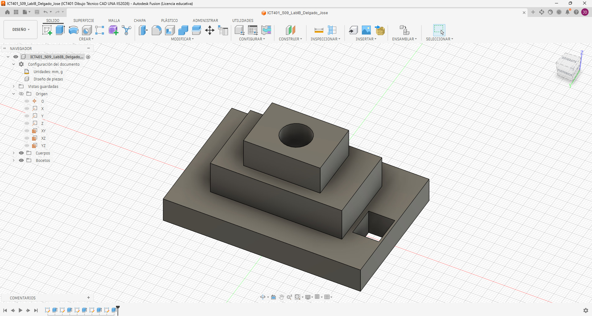
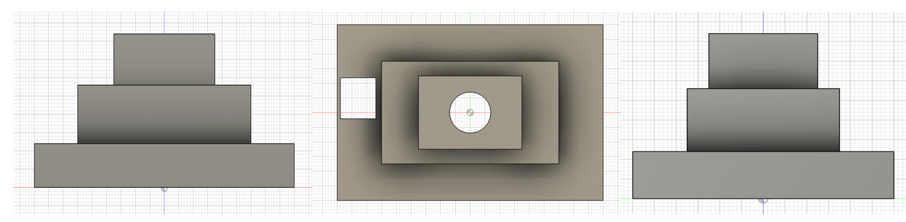
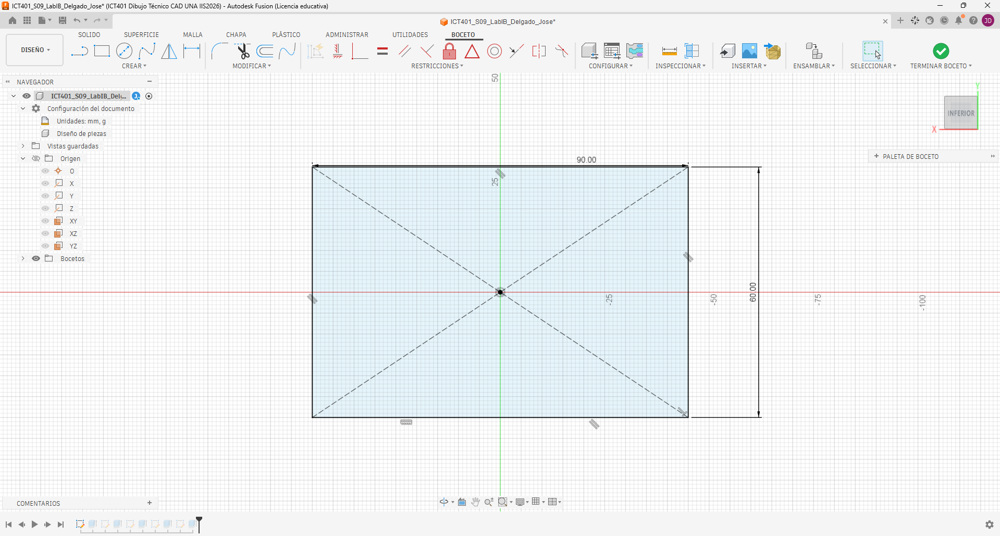
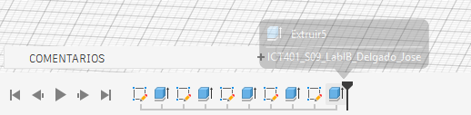
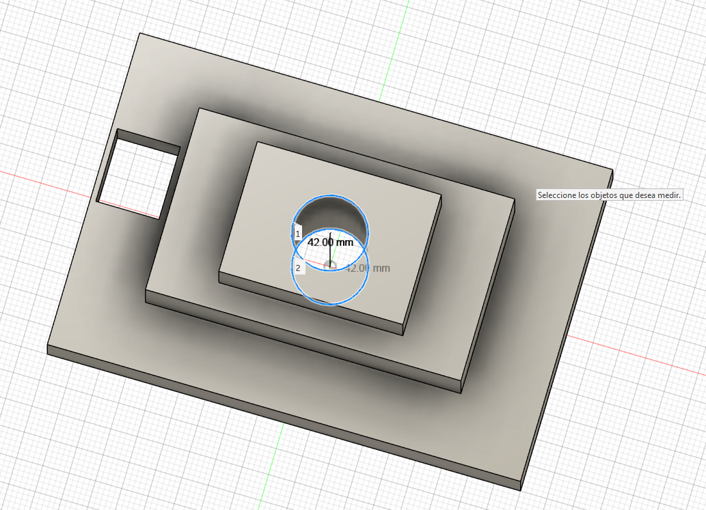

# ICT401 · Semana 9 — Laboratorio integrador I-B

**Reconstrucción 3D a partir de un plano o conjunto de vistas — 10 %**

- Estudiante: [Jose daniel delgado herrera]
- Grupo: [60]
- Fecha: [17 de septiembre del 2026]
- Nombre del archivo de Fusion: `ICT401_S09_LabIB_Apellido_Nombre`
- Carpeta/proyecto de Fusion Cloud con acceso docente: [Respuesta]
- Commit de entrega: [Respuesta]

## Instrucciones de uso de esta ficha

Complete esta ficha durante el laboratorio. No borre respuestas iniciales aunque luego las corrija. Cuando cambie una decisión, explique qué evidencia del plano o del modelo motivó la modificación.

La ficha debe quedar en `Portafolio/semana09/` con el nombre `S09_Lab_IB_Evidencias_Apellido_Nombre.md`. Las imágenes enlazadas deben estar en la misma carpeta. El archivo nativo permanece en Fusion Cloud con acceso docente.

Esta ficha forma parte de la evidencia evaluable del Laboratorio integrador I-B y está estructurada para facilitar una revisión posterior por la persona docente o mediante ChatGPT. La calificación final corresponde siempre al instrumento oficial del curso.

---

## A. Interpretación inicial del plano

### A1 · Dimensiones generales

- X total: [90 mm]
- Y total: [60 mm
]
- Z total: [42 mm]

### A2 · Características geométricas identificadas

| Nº | Característica | Descripción | Vista(s) que la definen | Dimensiones asociadas |
|---|---|---|---|---|
| 1 | [Base] | [Base rectangular que forma el cuerpo inferior de la pieza.] | [Front, Top y Right] | [90 × 60 mm; altura 12 mm] |
| 2 | [Plataforma] | [Plataforma elevada ubicada en la parte posterior, sobre la base.] | [Front, Top y Right] | [X = 0–60 mm; Y = 25–60 mm; altura adicional 16 mm] |
| 3 | [Torre] | [Torre ubicada sobre la plataforma en el lado izquierdo.] | [Front, Top y Right] | [X = 0–25 mm; Y = 25–60 mm; altura adicional 14 mm] |
| 4 | [Agujero] | [Perforación circular vertical pasante.] | [Top, Front y Right] | [Ø14 mm; centro (42,42)] |
| 5 | [Ranura] | [Ranura rectangular vertical pasante ubicada en la zona frontal derecha.] | [Top, Front y Right] | [14 × 12 mm; X = 68–82 mm; Y = 10–22 mm] |

### A3 · Describa la pieza en una frase técnica antes de abrir Fusion

[La pieza es un sólido escalonado formado por una base rectangular de 90 × 60 mm y 12 mm de altura, una plataforma posterior de 60 × 35 mm, una torre de 25 × 35 mm que alcanza una altura total de 42 mm, un agujero vertical pasante de Ø14 mm y una ranura rectangular vertical pasante de 14 × 12 mm.]

### A4 · ¿Qué plano de boceto utilizará primero y por qué?

[Utilizaré primero el plano XY porque permite definir directamente el ancho X y la profundidad Y de la base. En este plano realizaré el rectángulo de 90 × 60 mm y después lo extruiré 12 mm en Z. A partir de la cara superior de la base podré construir la plataforma y posteriormente la torre, relacionando sus posiciones con la vista Top y sus alturas con Front y Right.]

### A5 · Estrategia inicial de modelado

1 Crear un Sketch en el plano XY y dibujar la base de 90 × 60 mm; extruirla 12 mm en Z.
2 Crear un segundo Sketch sobre la cara superior de la base para dibujar la plataforma en X = 0–60 y Y = 25–60; extruirla 16 mm adicionales.
3 Crear un tercer Sketch sobre la plataforma para dibujar la torre en X = 0–25 y Y = 25–60; extruirla 14 mm adicionales hasta alcanzar la altura total de 42 mm.
4 Crear el agujero de Ø14 mm en la posición indicada por el centro (42,42) y realizar un corte vertical pasante.
5 Crear la ranura rectangular de 14 × 12 mm en X = 68–82 y Y = 10–22 y realizar un corte vertical pasante.
6 Comparar las vistas Front, Top y Right del modelo con el plano y comprobar las dimensiones críticas utilizando Inspect → Measure.

---

## B. Desarrollo del modelo

### B1 · Boceto base

- Plano seleccionado: [XY]
- Geometría principal: [Rectángulo de 90 × 60 mm que representa la base de la pieza.]
- Restricciones aplicadas: [Coincidencia con el origen, líneas horizontales y verticales y restricciones de coincidencia entre los extremos de las líneas.]
- Dimensiones aplicadas: [90 mm de ancho total y 60 mm de profundidad total.]
- Estado del boceto: [Totalmente restringido y cerrado, listo para realizar la primera extrusión.]

### B2 · Operaciones principales realizadas

| Orden | Operación | Propósito geométrico | Parámetro/dimensión principal | Resultado |
|---|---|---|---|---|
| 1 | [Sketch base] | [Definir la base rectangular de la pieza] | [90 × 60 mm] | [Perfil cerrado de la base] |
| 2 | [Extrude base] | [Crear el cuerpo inferior] | [12 mm] | [Base sólida de 90 × 60 × 12 mm] |
| 3 | [Sketch + Extrude plataforma] | [Crear la plataforma posterior] | [X = 0–60, Y = 25–60; +16 mm] | [Plataforma elevada hasta 28 mm] |
| 4 | [Sketch + Extrude torre] | [Crear la torre izquierda] | [X = 0–25, Y = 25–60; +14 mm] | [Altura total de 42 mm] |
| 5 | [Hole/Cut] | [Crear la perforación vertical] | [Ø14 mm; centro (42,42)] | [Agujero pasante] |
| 6 | [Sketch + Cut ranura] | [Crear la ranura rectangular] | [14 × 12 mm; X = 68–82, Y = 10–22] | [Ranura pasante] |

### B3 · Cambios respecto a la estrategia inicial

| Cambio realizado | Motivo | Vista/dimensión que reveló el problema | Sketch/operación corregida |
|---|---|---|---|
| [No fue necesario realizar cambios] | [La estrategia inicial coincidió con el plano] | [Front, Top y Right fueron coherentes] | [No fue necesario modificar ningún Sketch u operación] |
| [No fue necesario realizar cambios] | [Las posiciones de plataforma y torre coincidieron con el plano] | [Top permitió comprobar X y Y] | [No fue necesario modificar el Sketch de plataforma o torre] |
| No fue necesario realizar cambios] | [El agujero y la ranura se ubicaron según las cotas del plano] | [El agujero y la ranura se ubicaron según las cotas del plano] | [No fue necesario modificar las operaciones de corte] |

---

## C. Verificación contra el plano

### C1 · Correspondencia de vistas

| Vista | ¿Coincide? | Evidencia geométrica | Diferencia detectada | Corrección realizada |
|---|---|---|---|---|
| Front | [Sí] | [Coinciden el contorno exterior, la base, la plataforma y la torre; la altura máxima es 42 mm] | [Ninguna] | [No fue necesaria corrección] |
| Top | [Sí] | [Coinciden el contorno de 90 × 60 mm, la plataforma, la torre, el agujero y la ranura] | [Ninguna] | [No fue necesaria corrección] |
| Right | [Sí] | [Coinciden la profundidad de 60 mm, la base de 12 mm, la plataforma y la altura total de 42 mm] | [Ninguna] | [No fue necesaria corrección] |

### C2 · Comprobación dimensional

| Nº | Dimensión crítica | Valor del plano | Valor medido en Fusion | Elemento seleccionado | ¿Coincide? |
|---|---|---|---|---|---|
| 1 | [Respuesta] | [Respuesta] | [Respuesta] | [Respuesta] | [Respuesta] |
| 2 | [Respuesta] | [Respuesta] | [Respuesta] | [Respuesta] | [Respuesta] |
| 3 | [Respuesta] | [Respuesta] | [Respuesta] | [Respuesta] | [Respuesta] |
| 4 | [Respuesta] | [Respuesta] | [Respuesta] | [Respuesta] | [Respuesta] |
| 5 | [Respuesta] | [Respuesta] | [Respuesta] | [Respuesta] | [Respuesta] |

### C3 · Editabilidad paramétrica

Si una dimensión principal de la pieza cambiara, indique qué Sketch, dimensión u operación tendría que editar y por qué.

[Respuesta]

---

## D. Evidencias

### D1 · Modelo final

Modelo completo en orientación pictórica, con nombre del diseño y ViewCube visibles.

### D2 · Vistas de verificación

Montaje de Front, Top y Right del modelo, presentado de manera clara para comparar con el plano base.

### D3 · Boceto y restricciones

Captura del boceto más representativo con restricciones y dimensiones visibles.

### D4 · Timeline / historial paramétrico

Captura donde se observen las operaciones principales del historial del modelo.

### D5 · Verificación dimensional

Captura de `Inspect > Measure` con una dimensión crítica y el elemento seleccionado visibles.

---

## E. Checklist de entrega

- [ ☑️] Analicé el plano antes de comenzar el modelado.
- [☑️ ] Registré X, Y y Z totales.
- [☑️ ] Identifiqué las características principales y las vistas que las definen.
- [☑️ ] Registré una estrategia inicial antes de modelar.
- [☑️ ] El modelo final corresponde a Front, Top y Right.
- [☑️ ] Verifiqué al menos cinco dimensiones críticas.
- [☑️ ] Los bocetos principales tienen restricciones y dimensiones coherentes.
- [☑️ ] El historial de operaciones es legible y editable.
- [☑️ ] El nombre del archivo cumple la nomenclatura solicitada.
- [☑️ ] El archivo editable está disponible en Fusion Cloud con acceso docente.
- [☑️ ] Las cinco evidencias se visualizan correctamente en GitHub.
- [☑️ ] Esta ficha está completa.

---

# F. Rúbrica oficial del Laboratorio integrador I-B

> Esta rúbrica reproduce los criterios y valores establecidos en el programa oficial. La persona docente puede anotar el puntaje obtenido y observaciones en las columnas finales.

| Criterio oficial | Valor máximo | Evidencia principal en esta ficha | Puntaje obtenido | Observaciones de evaluación |
|---|---:|---|---:|---|
| Interpretación correcta del plano o conjunto de vistas | 2,0 % | Secciones A1–A5 y C1 | [Evaluador] | [Evaluador] |
| Reconstrucción tridimensional coherente | 2,5 % | Secciones B1–B3, D1 y D2 | [Evaluador] | [Evaluador] |
| Aplicación de restricciones y dimensiones | 1,5 % | B1, D3 y C2 | [Evaluador] | [Evaluador] |
| Precisión geométrica y correspondencia con el plano | 2,0 % | C1, C2, D2 y D5 | [Evaluador] | [Evaluador] |
| Organización, nomenclatura y archivo editable | 1,0 % | Identificación, B2, D4 y checklist | [Evaluador] | [Evaluador] |
| Presentación y cumplimiento del enunciado | 1,0 % | Ficha completa, evidencias y checklist | [Evaluador] | [Evaluador] |
| **Total** | **10,0 %** |  | **[Evaluador]** | **[Evaluador]** |

## G. Resumen para evaluación asistida por ChatGPT

Este bloque debe permitir una revisión rápida sin tener que inferir información faltante.

- ¿El estudiante interpretó correctamente X, Y y Z? [Respuesta]
- ¿Las características listadas corresponden con el plano? [Respuesta]
- ¿La estrategia inicial es coherente? [Respuesta]
- ¿El modelo final coincide con las tres vistas? [Respuesta]
- ¿Las dimensiones críticas coinciden? [Respuesta]
- ¿Los bocetos muestran restricciones y dimensiones adecuadas? [Respuesta]
- ¿El timeline muestra una reconstrucción paramétrica razonable? [Respuesta]
- ¿El archivo y las evidencias cumplen nomenclatura y presentación? [Respuesta]
- Incidencias que el evaluador debería revisar directamente en Fusion: [Respuesta]

## H. Retroalimentación del evaluador

### Fortalezas

[Evaluador]

### Aspectos por corregir

[Evaluador]

### Calificación final

**[Evaluador] / 10,0 %**
