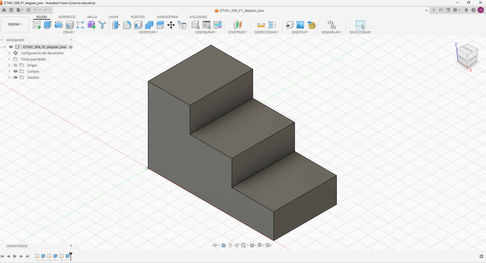
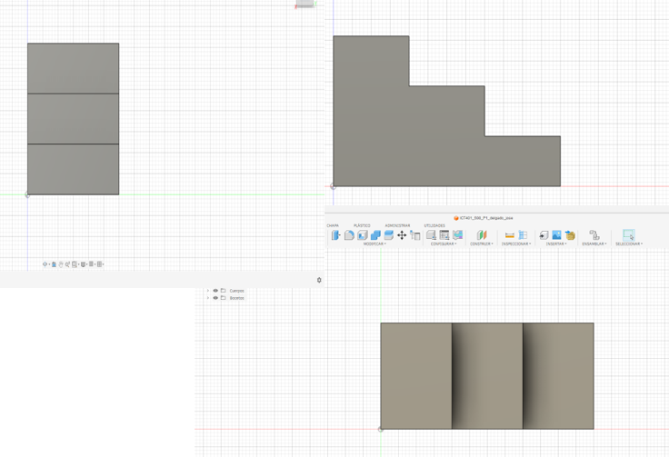
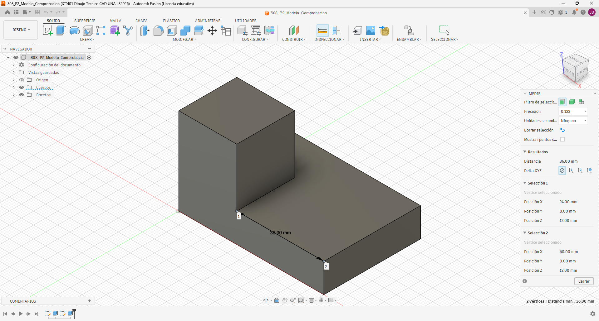

# ICT401 · Semana 8 — Registro formativo de práctica en Fusion

7 al 12 de septiembre de 2026. V Congreso Universitario. Consolidación de contenidos. Sin evaluaciones.

- Estudiante: [Jose Daniel Delgado Herrera]
- Grupo: [60]
- Carpeta o proyecto de Fusion Cloud con acceso docente (sin enlaces privados): [Respuesta]
- Modelos proporcionados: `S08_P1_Modelo_Observacion.f3d` y, después de P2, `S08_P2_Modelo_Comprobacion.f3d`.
- Copias personales: `ICT401_S08_P1_Apellido_Nombre` y `ICT401_S08_P2_Apellido_Nombre`.
- Diseños propios: `ICT401_S08_P4_Apellido_Nombre` y `ICT401_S08_P5_Apellido_Nombre`.

## Instrucciones

Copie esta plantilla a `Portafolio/semana08/` y guárdela como `S08_Registro_Apellido_Nombre.md`. Sustituya `Apellido_Nombre` en todos los nombres y enlaces por un apellido y un nombre sin espacios ni tildes. Complete cada [Respuesta], agregue las ocho imágenes en esa misma carpeta y haga commit. No necesita construir otra plantilla.

Escriba las predicciones y decisiones iniciales antes de comprobar. **Nunca borre una respuesta inicial incorrecta:** conserve lo escrito y agregue la corrección y su causa en el apartado posterior. Use la guía para los recursos gráficos y los tiempos de cada P1–P5 (50 minutos cada uno).

X = ancho, Y = profundidad, Z = altura; milímetros. Primer diedro: Right a la izquierda de Front y Top debajo de Front. Cámara ortográfica. Los montajes documentan correspondencia, no son planos a escala: compruebe dimensiones con Measure, no con píxeles. Combine capturas con una herramienta de imágenes o diapositivas y guarde un único PNG por nombre; no deforme imágenes ni oculte el ViewCube. Los recortes temporales no se entregan.

## P1 — Del modelo 3D a las vistas

### P1.1 · Antes de seleccionar Front, Top o Right: ¿qué características, caras y aristas espera ver en cada vista y qué dimensiones aparecerán horizontal y verticalmente?

[Front: espero observar el ancho y la altura de la pieza. Horizontalmente corresponde al eje X y verticalmente al eje Z.
Top: espero observar el ancho y la profundidad. Horizontalmente corresponde a X y verticalmente a Y.
Right: espero observar la profundidad y la altura. Horizontalmente corresponde a Y y verticalmente a Z.]

### P1.2 · ¿Cuál vista considera inicialmente más informativa y por qué?

[Considero que Front es la vista más informativa inicialmente porque permite identificar directamente el ancho y las diferentes alturas de la pieza.]

### P1.3 · Después de observar Front, Top y Right: ¿qué predicciones confirmó y qué corrigió? Explique por qué sin borrar su respuesta inicial.

[con front logre ver la altura y lo largo de la figura, con top logre ver el largo y los niveles de los escalones y con right se puede ver la altura y los escalones como divisiones en un rectangulo]

### P1.4 · ¿Qué pares de vistas comparten ancho, altura y profundidad? Anote el valor comprobado en milímetros y la arista seleccionada.

[Front y Top comparten el ancho X de 60 mm
Front y Right comparten la altura Z de 36mm.
Top y Right comparten la profundidad Y de 64.62mm.]

### P1.5 · Elija una característica tridimensional: ¿cómo aparece en dos vistas diferentes? Identifique las caras o aristas relacionadas.

[Un cambio de nivel de la pieza puede aparecer como una arista o cambio de contorno en Front y como una línea de cambio de zona en Top. Las dos representaciones corresponden a la misma característica tridimensional, pero observada desde direcciones diferentes.]

| Vista | Predicción inicial: características y dimensiones | Observación posterior | Corrección y causa |
|---|---|---|---|
| Front | [Espero observar el perfil escalonado de la pieza, con tres niveles de altura. Horizontalmente veré el ancho X y verticalmente la altura Z.] | [Se observa claramente el perfil escalonado con tres niveles. Se confirma que Front representa X–Z. | [No fue necesario corregir la predicción. La vista confirmó que el perfil frontal muestra el ancho y las alturas de los tres niveles.] |
| Top | [Espero observar la distribución de los escalones desde arriba. Horizontalmente veré el ancho X y verticalmente la profundidad Y.] | [Se observa la distribución de las diferentes zonas de la pieza desde arriba. Se confirma que Top representa X–Y.] | [No fue necesario corregir la predicción. La vista confirma que permite identificar el ancho y la profundidad.] |
| Right | [Espero observar los cambios de altura a lo largo de la profundidad. Horizontalmente veré la profundidad Y y verticalmente la altura Z.] | [Se observan los cambios de nivel de la pieza desde el lado derecho. Se confirma que Right representa Y–Z.] | [No fue necesario corregir la predicción. La vista confirma la relación entre profundidad y altura.] |

| Dimensión compartida | Par de vistas | Valor (mm) y arista seleccionada |
|---|---|---|
| Ancho | [Front ↔ Top] | [60mm — arista horizontal completa que representa el ancho X] |
| Altura | [Front ↔ Right] | [36mm — arista vertical completa que representa la altura Z |
| Profundidad | [Top ↔ Right] | [20mm arista horizontal completa que representa la profundidad Y] |

### Evidencias

Modelo completo en orientación pictórica, ViewCube y nombre de su copia visibles.

Un montaje de tres capturas de Fusion: Right a la izquierda, Front a la derecha y Top debajo de Front; etiquetas y cuerpo completo visibles.

## P2 — De las vistas al modelo mental

### P2.1 · ¿Qué forma general imagina y cuáles son sus cambios de altura?

[Imagino una pieza prismática escalonada, formada por una zona de mayor altura y otra zona de menor altura. La altura cambia de una zona a otra, formando un escalón claramente visible en Front y Right.]

### P2.2 · ¿La profundidad se mantiene o cambia entre zonas? Relacione las tres vistas.

[La profundidad total se mantiene como parte de la pieza, pero la posición de los cambios de altura se distribuye a lo largo de la profundidad. Por eso es necesario relacionar Top con Right para determinar dónde se encuentra cada zona respecto al frente y al fondo.]

### P2.3 · ¿Qué correspondencias encuentra entre vistas?

[Front y Top comparten el ancho X. Front y Right comparten la altura Z. Top y Right comparten la profundidad Y. Estas correspondencias permiten ubicar los cambios de altura y profundidad sin modificar la orientación de la pieza.]

### P2.4 · ¿Qué información aporta Top y qué información aporta Right?

[Top permite conocer cómo se distribuye la pieza en ancho y profundidad, es decir, X y Y. Right permite comprobar cómo cambia la altura a lo largo de la profundidad, es decir, Y y Z.]

### P2.5 · Describa verbalmente la pieza imaginada antes de mirar las alternativas.

[Imagino una pieza maciza con forma escalonada. Tiene una base de menor altura y una zona elevada que ocupa una parte del ancho y de la profundidad. La zona elevada produce cambios de altura visibles en Front y Right, mientras que Top permite localizar su posición sobre la superficie.]

### P2.6 · ¿Selecciona A, B, C o D? Justifique antes de comprobar y descarte cada una de las otras tres mediante una vista.

[Por la combinación de las tres vistas, B es la alternativa que corresponde a la distribución indicada: una zona elevada hacia el frente y una zona baja que continúa hacia el fondo.Mi selección se basa en que la vista Front muestra el cambio de altura y la vista Right confirma la posición de la zona elevada respecto de la profundidad. La vista Top permite comprobar la ubicación de esa zona en X–Y.]

### P2.7 · Después de comprobar: ¿fue correcta su selección, qué interpretó incorrectamente si falló y qué vista fue decisiva? Conserve la selección inicial y explique la corrección.

[La selección B fue correcta. La comprobación en Fusion confirmó que la distribución de la zona elevada y la zona de menor altura coincide con las vistas Front, Top y Right. La vista Right fue especialmente decisiva porque permitió comprobar la posición de la zona elevada respecto a la profundidad.]

| Alternativa | Justificación inicial: seleccionar o descartar | Vista que apoya mi decisión |
|---|---|---|
| A | [Selecciono A porque la zona elevada coincide con la posición y la forma mostradas en las tres vistas. La distribución del escalón corresponde con Front, Top y Right.] | [Top y Right] |
| B | [Descarto B porque la zona elevada tiene una profundidad diferente a la indicada por las vistas, por lo que no coincide correctamente con la distribución mostrada en Top.] | [Top] |
| C | [Descarto C porque presenta una zona elevada diferente y no mantiene la misma distribución de alturas que aparece en Front y Right.] | [Front] |
| D | [Descarto D porque la zona elevada no coincide con la posición indicada en las vistas, especialmente en la relación entre la profundidad y la zona frontal.] | [Top] |

### Evidencias

Modelo correcto proporcionado por el docente durante la comprobación, en orientación pictórica, con nombre y ViewCube visibles.

## P3 — Detectives de vistas

### P3.1 · Caso A: ¿qué vista parece incorrecta, qué línea produce la inconsistencia, con cuál otra vista entra en contradicción y cómo debería corregirse?

[La vista que parece incorrecta es Top. La inconsistencia está en la línea horizontal que aparece atravesando toda la pieza. Esa línea entra en contradicción con la vista Right, porque la zona elevada no debería generar una arista que atraviese todo el ancho de la pieza. Al relacionar Top con Right, la línea debería representar únicamente el límite real entre la zona elevada y la zona baja.]

### P3.2 · Caso B: ¿qué dimensión debería conservarse, dónde aparece la contradicción, qué información permite comprobarla y cómo debería corregirse?

[La dimensión que debería conservarse es la profundidad Y, porque Top y Right comparten la profundidad. La contradicción aparece porque en Top se indica una profundidad total de 48 mm, mientras que en Right se indica una profundidad total de 40 mm. Estos dos valores no pueden representar correctamente la misma pieza al mismo tiempo. Para comprobarlo, se debe utilizar Inspect/Inspeccionar → Measure/Medir en Fusion y seleccionar la arista completa que representa la profundidad del sólido. La corrección consiste en cambiar el valor de la vista que no coincida con la medida real obtenida en Fusion.]

### P3.3 · Caso C: ¿cuál vista no pertenece al conjunto, qué característica lo demuestra, con cuáles vistas entra en contradicción y qué debería mostrar una vista correcta?

[La vista que no pertenece al conjunto es Front. La característica que demuestra el error es la posición de la zona elevada, que aparece en el lado contrario respecto a la posición que se obtiene al relacionar Top y Right. Por esta razón, Front entra en contradicción con Top y Right. Una vista Front correcta debería mostrar la zona elevada en la posición que corresponde con las otras dos vistas, manteniendo la misma ubicación espacial de las caras y aristas.]

### P3.4 · Para cada caso: ¿qué acción realizó en Fusion, qué observó y cómo corrigió su hipótesis inicial?

[Caso A: Recuperé el modelo de comprobación de P2 y seleccioné las vistas Top, Front y Right en el ViewCube. Después orbité el modelo para localizar las caras relacionadas con la línea que parecía incorrecta. Observé que la línea horizontal de Top no correspondía con una arista real en toda su longitud. Por eso confirmé que el error estaba en Top.

Caso B: Recuperé el modelo de comprobación y utilicé Inspeccionar → Medir (Measure). Seleccioné la arista completa correspondiente a la profundidad y comparé la medida obtenida con los valores de 48 mm y 40 mm. La vista cuyo valor no coincidió con la medida real fue la que debía corregirse.

Caso C: Recuperé el modelo y alterné entre Front, Top y Right. Orbité el sólido para comprobar la posición de la zona elevada respecto al frente. Observé que la posición representada en Front no coincidía con la ubicación indicada por Top y Right, por lo que confirmé que Front era la vista que no pertenecía al conjunto.]

### P3.5 · ¿Qué caso documentó en la captura y qué detalle demuestra el error?

[Documenté el Caso B, porque permite demostrar el error de manera clara utilizando la herramienta Measure. En la captura se debe observar la arista completa seleccionada y la longitud obtenida, además del nombre del diseño y el ViewCube. Así se puede comprobar directamente cuál de las dos profundidades indicadas, 48 mm o 40 mm, coincide con el sólido real.]

| Caso | Hipótesis inicial | Acción en Fusion y observación | Corrección y causa |
|---|---|---|---|
| A | [La vista Top parece incorrecta porque la línea horizontal atraviesa toda la pieza y no parece corresponder con la zona elevada mostrada en Right.] | [Abrí el modelo de comprobación de P2, alterné entre Top, Front y Right y orbité el sólido para localizar las caras relacionadas.] | [Corregir Top, haciendo que la línea represente solamente la arista real del cambio de nivel. La causa es una continuidad incorrecta de la arista en la vista.] |
| B | [La profundidad debe ser la misma en Top y Right, pero aparece como 48 mm en Top y 40 mm en Right.] | [Usé Inspeccionar → Medir y seleccioné la arista completa que representa la profundidad. Comparé la medida real del sólido con 48 mm y 40 mm.] | [Corregir la vista cuyo valor no coincida con la medida real obtenida en Fusion. La causa es que Top y Right deben conservar la misma dimensión Y.] |
| C | [La vista Front parece incorrecta porque la zona elevada está ubicada en el lado contrario al que indican Top y Right.] | [Alterné entre Front, Top y Right y orbité el sólido para comprobar la posición de la zona elevada respecto al frente. Observé que Front no coincidía con las otras dos vistas.] | [Corregir Front para que la zona elevada quede en la posición indicada por Top y Right. La causa es que la vista representa la posición de la característica de otra pieza.] |

### Evidencias

Una vista de Fusion que compruebe uno de los errores; nombre y ViewCube visibles. Para el caso B, incluya Measure con la arista completa y su longitud.

## P4 — Reconstrucción 3D guiada

### P4.1 · Antes de abrir Fusion: indique ancho total, altura máxima, profundidad total y número de niveles o cambios principales.

[Respuesta]

### P4.2 · ¿Qué vista usará como referencia, qué plano inicial elegirá y cómo será su boceto base? Justifique relacionando las vistas.

[Respuesta]

### P4.3 · ¿Cuál será su primera operación 3D y qué características posteriores prevé? Justifique.

[Respuesta]

### P4.4 · Después de construir: ¿coincide Front, coincide Top y coincide Right? Para cada vista cite un contorno, una arista y una dimensión comprobada.

[Respuesta]

### P4.5 · ¿Qué fue necesario corregir y qué Sketch, operación o dimensión controlaba la corrección? Si no hubo cambios, justifique con una comprobación.

[Respuesta]

| Vista | ¿Coincide? | Contorno y arista | Dimensión comprobada (mm) | Corrección y causa |
|---|---|---|---|---|
| Front | [Respuesta] | [Respuesta] | [Respuesta] | [Respuesta] |
| Top | [Respuesta] | [Respuesta] | [Respuesta] | [Respuesta] |
| Right | [Respuesta] | [Respuesta] | [Respuesta] | [Respuesta] |

### Evidencias

Modelo terminado completo en orientación pictórica, nombre del diseño y ViewCube visibles.

Montaje con tres pares: vista de referencia de esta guía junto a su correspondiente vista de Fusion. Disponga Right a la izquierda, Front a la derecha y Top debajo de Front.

## P5 — Reto de reconstrucción autónoma

### P5.1 · Antes de modelar: indique ancho total, altura máxima y profundidad total.

[Respuesta]

### P5.2 · ¿Qué vista elegirá para comenzar, qué plano inicial y qué primera operación prevé? Justifique.

[Respuesta]

### P5.3 · ¿Qué características posteriores prevé, cuál es la más difícil de interpretar y qué vistas necesita relacionar para comprenderla?

[Respuesta]

### P5.4 · Después de construir: ¿coinciden Front, Top y Right? Para cada vista cite un contorno, una arista y una dimensión comprobada.

[Respuesta]

### P5.5 · ¿Funcionó la estrategia inicial, qué tuvo que modificar, qué vista permitió detectarlo y qué haría diferente si reconstruyera nuevamente la pieza?

[Respuesta]

| Vista | ¿Coincide? | Contorno y arista | Dimensión comprobada (mm) | Corrección y causa |
|---|---|---|---|---|
| Front | [Respuesta] | [Respuesta] | [Respuesta] | [Respuesta] |
| Top | [Respuesta] | [Respuesta] | [Respuesta] | [Respuesta] |
| Right | [Respuesta] | [Respuesta] | [Respuesta] | [Respuesta] |

### Evidencias

Modelo terminado completo en orientación pictórica, nombre del diseño y ViewCube visibles.

Montaje con tres pares: vista de referencia de esta guía junto a su correspondiente vista de Fusion. Disponga Right a la izquierda, Front a la derecha y Top debajo de Front.

## Reflexión final

Una vista por sí sola puede ser insuficiente porque:

[Respuesta]

Para relacionar correctamente varias vistas debo comprobar:

[Respuesta]

Antes de comenzar una reconstrucción 3D conviene:

[Respuesta]

La diferencia principal entre lo que hice en Semana 7 y Semana 8 es:

[Respuesta]

Lo que todavía necesito practicar antes de reconstruir una pieza a partir de un plano es:

[Respuesta]

## Checklist

- [ ] Completé P1 antes y después de observar las vistas.
- [ ] Justifiqué mi selección en P2.
- [ ] Identifiqué y comprobé inconsistencias en P3.
- [ ] Planifiqué P4 antes de comenzar a modelar.
- [ ] Comprobé P4 contra las tres vistas originales.
- [ ] Realicé P5 con mayor autonomía.
- [ ] Comprobé P5 contra las vistas originales.
- [ ] Respondí las preguntas de reflexión.
- [ ] Las ocho imágenes se visualizan correctamente en GitHub.
- [ ] Mis modelos P4 y P5 están disponibles para revisión docente en Fusion Cloud.
- [ ] Conservé mis predicciones iniciales aunque fueran incorrectas.
- [ ] Expliqué las correcciones realizadas.
- [ ] El commit utiliza el mensaje solicitado.

Commit: `S08 ejercicios Fusion Apellido Nombre`.

Corrección posterior: `S08 correccion Fusion Apellido Nombre`.

Abra el registro en GitHub y compruebe los ocho enlaces. Los archivos nativos permanecen en Fusion Cloud con acceso docente. Este registro conserva práctica formativa y no constituye una entrega evaluada de portafolio.
