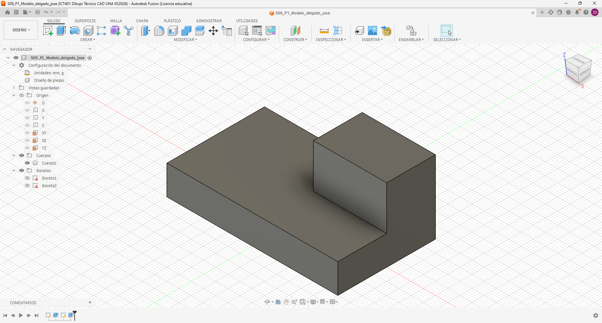
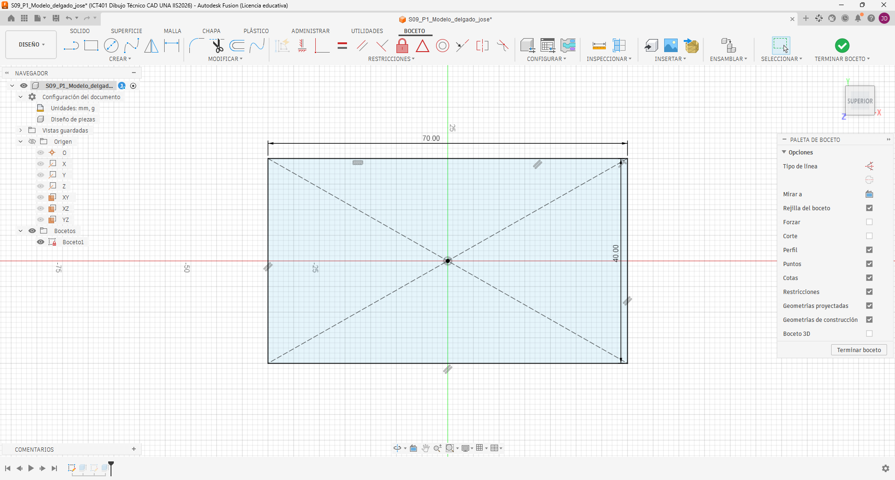
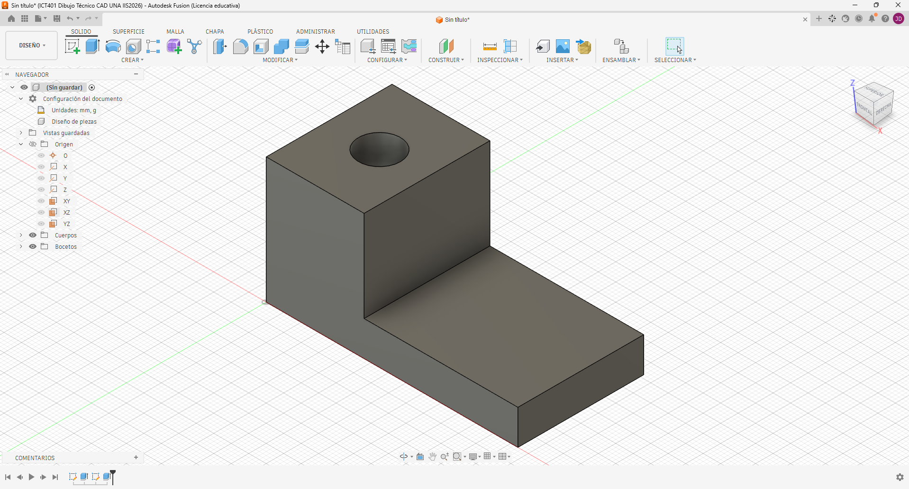
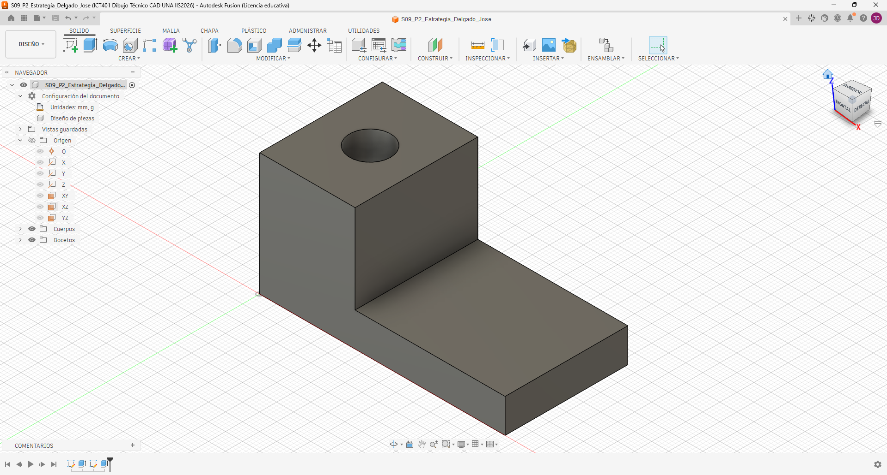
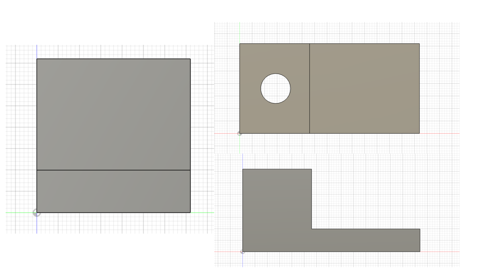

# ICT401 · Semana 9 — Registro de interpretación y reconstrucción 3D

14 al 19 de septiembre de 2026.

- Estudiante: [Jose daniel delgado herrera]
- Grupo: [60]
- Carpeta o proyecto de Fusion Cloud con acceso docente: [Respuesta]
- Copias personales: `ICT401_S09_P1_Apellido_Nombre`, `ICT401_S09_P2_Apellido_Nombre`, `ICT401_S09_P3_Apellido_Nombre`.

## Instrucciones

Copie esta plantilla a `Portafolio/semana09/` y guárdela como `S09_Registro_Apellido_Nombre.md`. Sustituya `Apellido_Nombre` por un apellido y un nombre sin espacios ni tildes. Complete cada `[Respuesta]`, agregue las imágenes solicitadas en la misma carpeta y haga commit.

Conserve siempre la estrategia inicial. Si modifica una decisión durante el modelado, no borre lo anterior: describa qué cambió, qué evidencia del plano o del modelo motivó la corrección y qué elemento paramétrico modificó.

X = ancho, Y = profundidad, Z = altura. Trabaje en milímetros. Cuando compare vistas, mantenga Front, Top y Right con orientación coherente y cámara ortográfica.

---

## P1 — Del plano a la estrategia de modelado

### P1.1 · Dimensiones generales identificadas antes de abrir Fusion

- X total: [70mm]
- Y total: [40mm]
- Z total: [30mm]

### P1.2 · Características geométricas identificadas

| Característica | Descripción | Vista(s) que la definen | Dimensiones asociadas |
|---|---|---|---|
| 1 | [Base rectangular de la pieza | [Front y Top] | [70 mm de ancho × 40 mm de profundidad × 12 mm de altura] |
| 2 | [Resalte posterior izquierdo] | [Front, Top y Right] | [30 mm de ancho × 20 mm de profundidad] |
| 3 | [Altura total de la pieza] | [Front y Right] | [30 mm] |
| 4 | [Posición del resalte] | [Top] | [X = 0–30 mm y Y = 20–40 mm] |

### P1.3 · ¿Qué plano de boceto utilizará primero y por qué?

[Utilizaré primero el plano XY, porque permite definir directamente la forma y las dimensiones de la base, que tiene 70 mm de ancho y 40 mm de profundidad. Después puedo extruir la base 12 mm en Z y crear sobre ella el resalte posterior izquierdo de 30 × 20 mm. Esta estrategia relaciona la información de Top con las alturas que se comprueban en Front y Right.]

### P1.4 · Estrategia inicial de modelado

1-Crear un Sketch en el plano XY y dibujar un rectángulo de 70 × 40 mm para representar la base.
2-Extruir la base 12 mm en Z, obteniendo la altura de la plataforma principal.
3-Crear un segundo Sketch sobre la cara superior de la base y dibujar el resalte de 30 × 20 mm en la posición posterior izquierda.
4-Extruir el resalte 18 mm adicionales, para alcanzar la altura total de 30 mm.
5-Comprobar el modelo en Front, Top y Right, verificando las dimensiones de 70, 40 y 30 mm y las dimensiones del resalte.

### P1.5 · Después de comprobar en Fusion, ¿qué parte de la estrategia funcionó y qué tuvo que corregir?

[La estrategia de construir primero la base y después el resalte funcionó correctamente. Al comprobar el modelo en Fusion, verifiqué que la pieza tuviera la forma escalonada indicada en el plano y que el resalte estuviera ubicado en la parte posterior izquierda. La principal comprobación fue mantener la base en 70 × 40 mm, con 12 mm de altura, y llevar el resalte hasta una altura total de 30 mm.]

### P1.6 · ¿Qué vista o dimensión permitió detectar la corrección?

[La vista Top permitió comprobar la posición y el tamaño del resalte de 30 × 20 mm. La vista Front permitió comprobar la altura de la base de 12 mm y la altura total de 30 mm. La vista Right permitió comprobar la profundidad total de 40 mm y la profundidad del resalte.]

### Evidencias P1

Modelo parcial o final en orientación pictórica, con nombre del diseño y ViewCube visibles.

Captura donde se vea el Sketch, dimensión u operación que mejor representa la estrategia seguida.

---

## P2 — Dos estrategias para una misma pieza

### P2.1 · Resuma la estrategia A

[La estrategia A consiste en construir en el plano XZ el perfil frontal completo de la pieza en forma de L. Después se extruye ese perfil a toda la profundidad de 36 mm y finalmente se crea una perforación vertical pasante de diámetro 12 mm.]

### P2.2 · Resuma la estrategia B

[La estrategia B consiste en construir primero la base desde un Sketch en el plano XY y extruirla. Después se crea la torre izquierda mediante un segundo Sketch y una segunda extrusión con operación Join. Finalmente se realiza la perforación vertical pasante.]

### P2.3 · ¿Ambas estrategias pueden producir la misma geometría? Justifique.

[Sí, ambas estrategias pueden producir la misma geometría final. La diferencia está en la forma y el orden de construcción. La estrategia A crea primero todo el perfil frontal y después lo extruye, mientras que la estrategia B construye la base y luego agrega la torre como una característica independiente. En las dos estrategias se termina realizando la misma perforación vertical pasante.]

### P2.4 · Compare las estrategias

| Criterio | Estrategia A | Estrategia B | ¿Cuál considera mejor y por qué? |
|---|---|---|---|
| Número de operaciones | [Menos operaciones porque utiliza un perfil principal y una extrusión.] | [Más operaciones porque separa la base y la torre. | [A, porque la secuencia es más corta.] |
| Claridad de intención de diseño | [El perfil completo muestra directamente la forma general.] | [La base y la torre aparecen como características separadas.] | [B, porque permite reconocer cada característica por separado] |
| Facilidad de edición | [Un cambio puede requerir modificar el perfil principal.] | [La base y la torre pueden modificarse desde Sketch diferentes.] | [B, porque las partes están separadas.] |
| Dependencia entre operaciones | [La extrusión depende del perfil completo.] | [La segunda operación depende de la base y del segundo Sketch.] | [B, porque las características están organizadas sucesivamente.] |
| Correspondencia con el plano | [Se relaciona directamente con la vista Front.] | [Permite relacionar la base con Top y la torre con las demás vistas.] | [B, porque facilita identificar cada característica del plano.] |

### P2.5 · Si cambia una dimensión principal de la pieza, ¿qué estrategia sería más fácil de modificar? Explique qué Sketch u operación tendría que editar.

[La estrategia B sería más fácil de modificar porque la base y la torre están construidas mediante Sketch diferentes. Si cambia el tamaño de la base, editaría el primer Sketch y su extrusión. Si cambia el ancho o la altura de la torre, editaría el segundo Sketch y la extrusión correspondiente. Si cambia la perforación, modificaría el Sketch de la perforación y su diámetro o posición.]

### P2.6 · ¿Cuál estrategia usaría finalmente y por qué?

[Finalmente utilizaría la estrategia B porque permite separar las características principales de la pieza y facilita reconocerlas en el historial de operaciones. También permite modificar la base, la torre o la perforación de manera más independiente.]

### Evidencias P2

Captura del historial/timeline y del modelo obtenido con la estrategia seleccionada.

---

## P3 — Plano → modelo → plano

### P3.1 · Antes de modelar, describa la pieza en una frase técnica

[La pieza es un sólido escalonado formado por una base rectangular de 80 × 50 mm y 30 mm de altura, un resalte posterior de 45 × 30 mm que lleva la altura total a 45 mm, una perforación circular vertical pasante de Ø12 mm y una ranura rectangular vertical pasante de 12 × 16 mm.]

### P3.2 · Dimensiones y características clave

| Elemento | Valor o descripción | Vista(s) de donde se obtiene |
|---|---|---|
| X total | [80 mm] | [Front y Top] |
| Y total | [50 mm] | Right y Top |
| Z total | 45 mm | [Front y Right] |
| Característica 1 | [Base rectangular de 80 × 50 mm y 30 mm de altura] | [Base rectangular de 80 × 50 mm y 30 mm de altura] |
| Característica 2 | [Resalte posterior de 45 × 30 mm, con altura adicional de 15 mm] | [Front, Top y Right] |
| Característica 3 | [Agujero Ø12 mm y ranura rectangular 12 × 16 mm, ambas pasantes verticalmente] | [Top] |

### P3.3 · Estrategia inicial

1-Crear un Sketch en el plano XY y dibujar la base rectangular de 80 × 50 mm.
2-Extruir la base 30 mm en Z para obtener el cuerpo principal.
3-Crear un segundo Sketch sobre la cara superior para dibujar el resalte posterior de 45 × 30 mm y extruirlo 15 mm adicionales para alcanzar los 45 mm de altura total.
4-Crear el agujero Ø12 mm en la posición indicada por el plano, con centro en X = 22 mm y Y = 35 mm, y realizar un corte pasante en Z.
5-Crear la ranura rectangular de 12 × 16 mm en la posición X = 60–72 mm y Y = 8–24 mm y realizar un corte vertical pasante. Finalmente comprobar Front, Top y Right.
### P3.4 · Verificación de vistas

| Vista | ¿Coincide con el plano? | Contorno/característica comprobada | Corrección realizada |
|---|---|---|---|
| Front | [Sí] | [Ancho total de 80 mm, altura de la base de 30 mm y altura total de 45 mm] | [No fue necesaria corrección] |
| Top | [Sí] | Contorno de 80 × 50 mm, resalte de 45 × 30 mm, agujero y ranura] | [No fue necesaria corrección] |
| Right | [Sí] | [Profundidad total de 50 mm, altura de 30 mm de la base y 45 mm total] | [No fue necesaria corrección] |

### P3.5 · Verificación dimensional

| Dimensión crítica | Valor del plano | Valor medido en Fusion | Elemento medido | ¿Coincide? |
|---|---|---|---|---|
| 1 | [80 mm] | [80 mm] | [Ancho total de la base] | [Sí] |
| 2 | [50 mm] | [50 mm] | [Profundidad total de la pieza] | [Sí] |
| 3 | [45 mm] | [45 mm] | [Altura total de la pieza] | [Sí] |
| 4 | [Ø12 mm] | [Ø12 mm] | [Agujero circular pasante] | [Sí] |

### P3.6 · ¿Qué cambió entre su estrategia inicial y el modelo final?

[La estrategia inicial se mantuvo prácticamente igual durante el modelado. Primero construí la base, después agregué el resalte y finalmente realicé los cortes del agujero y de la ranura. Al comparar las tres vistas con el plano, comprobé que las dimensiones principales y la posición de las características fueran correctas.]

### P3.7 · Si tuviera que cambiar una dimensión principal, ¿qué Sketch, dimensión u operación editaría?

[Si tuviera que cambiar el ancho total de la pieza, editaría la dimensión de 80 mm del Sketch de la base y dejaría que las operaciones posteriores se actualizaran. Si cambiara la altura del resalte, editaría la dimensión de la extrusión del resalte. Para cambiar el agujero, modificaría su Sketch y la dimensión Ø12 mm.]

### Evidencias P3

Modelo final en orientación pictórica, con nombre y ViewCube visibles.

Montaje de Front, Top y Right del modelo para compararlos con el plano.

Captura de una comprobación dimensional con `Inspect > Measure`.

---

## Reflexión final

La diferencia principal entre reconstruir una pieza en Semana 8 y reconstruirla desde un plano en Semana 9 es:

[En Semana 8 se trabajó principalmente con la interpretación coordinada de las vistas, mientras que en Semana 9 se debe interpretar el plano y convertir esa información en una estrategia de modelado paramétrico antes de abrir Fusion. Además, en Semana 9 se debe verificar y corregir el modelo comparándolo con las vistas y dimensiones del plano.]

Antes de abrir Fusion, la información mínima que debo extraer de un plano es:

[Las dimensiones globales X, Y y Z, las alturas y niveles principales, las características geométricas de la pieza, la posición de cada característica y las vistas que permiten definir su forma y dimensiones.]

Una estrategia de modelado es mejor que otra cuando:

[Permite representar correctamente la geometría y, al mismo tiempo, facilita la edición, muestra claramente la intención de diseño y mantiene una relación lógica con las vistas y dimensiones del plano. No se debe elegir solamente por tener menos operaciones.]

La comprobación final más importante para asegurar que el modelo corresponde al plano es:

[Comparar las vistas Front, Top y Right del modelo con las correspondientes vistas del plano y verificar las dimensiones críticas mediante la herramienta Measure. El modelo debe coincidir geométricamente con las tres vistas y con las dimensiones indicadas.]

## Checklist

- [ ☑️] Registré la estrategia inicial de P1 antes de comprobar en Fusion.
- [☑️ ] Comparé dos estrategias en P2 y justifiqué mi selección.
- [ ] Reconstruí P3 a partir del plano sin usar un modelo 3D de referencia.
- [☑️ ] Comparé Front, Top y Right contra el plano.
- [☑️ ] Verifiqué al menos cuatro dimensiones críticas en P3.
- [☑️ ] Documenté las correcciones sin borrar mis decisiones iniciales.
- [☑️ ] Las cinco imágenes se visualizan correctamente en GitHub.
- [ ] Los modelos P1–P3 están disponibles en Fusion Cloud con acceso docente.
- [☑️ ] Completé la reflexión final.

Commit sugerido: `S09 ejercicios Fusion Apellido Nombre`.

Corrección posterior: `S09 correccion Fusion Apellido Nombre`.
