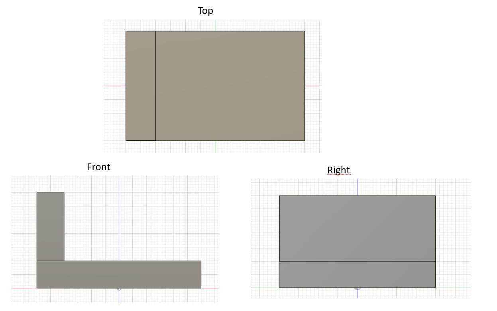
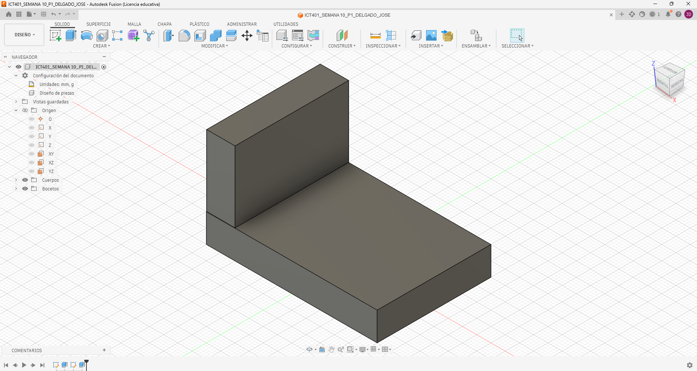
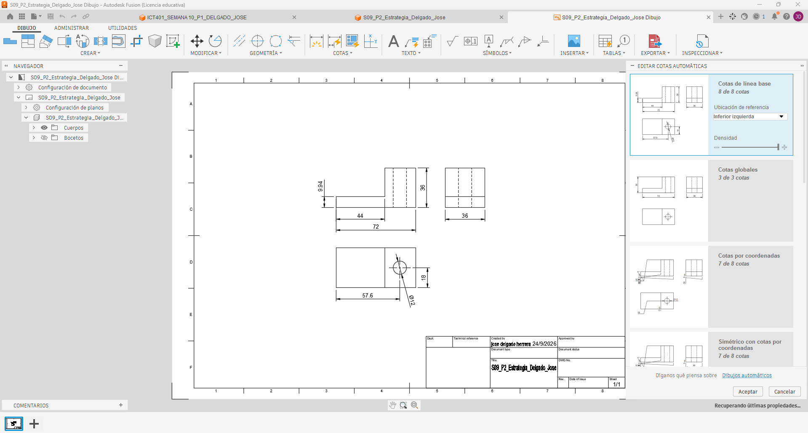
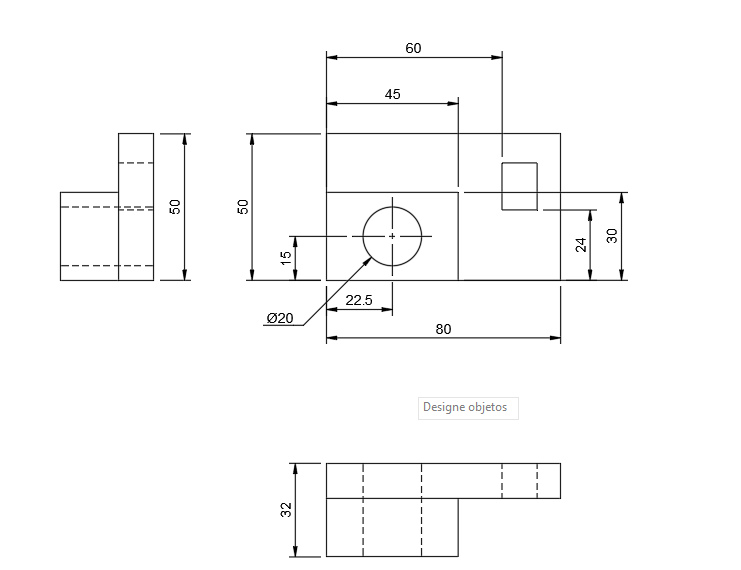
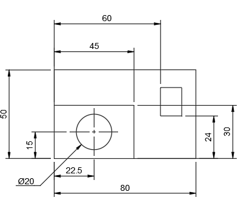

# ICT401 · Semana 10 — Registro de vistas técnicas y acotación normalizada

21 al 26 de septiembre de 2026.

- Estudiante: [jose daniel delgado herrera]
- Grupo: [60]
- Carpeta o proyecto de Fusion Cloud con acceso docente: [Respuesta]
- Modelos utilizados: `ICT401_S09_P1_Apellido_Nombre`, `ICT401_S09_P2_Apellido_Nombre`, `ICT401_S09_P3_Apellido_Nombre` u otros equivalentes.

## Instrucciones

Copie esta plantilla a `Portafolio/semana10/` y guárdela como `S10_Registro_Apellido_Nombre.md`. Sustituya `Apellido_Nombre` por un apellido y un nombre sin espacios ni tildes. Complete cada `[Respuesta]`, agregue las imágenes solicitadas en la misma carpeta y haga commit.

Documente cada decisión de selección de vistas y acotación. Si modifique una decisión durante el proceso, no borre lo anterior: describa qué cambio, qué evidencia del modelo o del Drawing motivó la corrección y qué ajuste realizó.

X = ancho, Y = profundidad, Z = altura. Trabaje en milímetros. Cuando compare vistas, mantenga Front, Top y Right con orientación coherente y cámara ortográfica.

---

## P1 — Del modelo 3D a las vistas técnicas

### P1.1 · Modelo utilizado

- Nombre del diseño en Fusion: [ICT401_S09_P3_Delgado_Jose]
- Pieza de referencia (semana de origen): [Semana 9, P3. Pieza con base, resalte, perforación y ranura.]

### P1.2 · Características principales del modelo

| Característica | Descripción | Vista(s) que la comunican |
|---|---|---|
| 1 | [Base rectangular de 80 mm de ancho, 50 mm de profundidad y 30 mm de altura.] | [Front, Top y Right] |
| 2 | [Resalte superior de 45 × 30 mm con una altura adicional de 15 mm.] | [Front y Top] |
| 3 | [Perforación circular de diámetro 12 mm, con centro ubicado en X=22 mm y Y=35 mm.] | [Top y Right] |
| 4 | [Ranura de 12 × 16 mm ubicada hacia un extremo de la pieza, entre X=60–72 mm y Y=8–24 mm.] | [Top y Front] |

### P1.3 · Vistas seleccionadas y justificación

| Vista | ¿Es necesaria? | ¿Por qué? | ¿Qué información aporta? |
|---|---|---|---|
| Front | [si] | [Permite observar el perfil general de la pieza y la diferencia de alturas entre la base y el resalte.] | [Ancho X, alturas y forma frontal.] |
| Top | [si] | [Permite observar la distribución de las características sobre la superficie superior.] | [Profundidad Y, posición de la perforación y posición de la ranura.] |
| Right | [si] | [Permite comprobar la profundidad y las alturas de la pieza desde el lateral.] | [Profundidad, alturas y posición vertical de las características.] |
| Otra: [No como vista técnica principal] | [Se utiliza para verificar visualmente el modelo 3D, pero no sustituye las vistas ortogonales.] | [Permite comprobar la correspondencia general entre el modelo y el Drawing.] |  |

### P1.4 · ¿Algual vista resultó redundante? ¿Cuál y por qué?

[La vista isométrica es redundante como vista técnica principal porque Front, Top y Right comunican las características necesarias de la pieza. Sin embargo, se conserva como evidencia para comparar el Drawing con el modelo 3D.]

### P1.5 · Método utilizado para generar las vistas en Fusion

[Se creó un Drawing a partir del modelo 3D en Fusion. Se utilizó Front como vista base y posteriormente se proyectaron las vistas Top y Right. Se verificó que las tres vistas conservaran la correspondencia geométrica y la alineación entre ellas.]

### Evidencias P1

Captura de las vistas ortogonales generadas desde el modelo.

Modelo 3D en orientación isométrica con nombre y ViewCube visibles.

---

## P2 — Creación del plano desde el modelo

### P2.1 · Configuración del Drawing

- Formato seleccionado: [A4]
- Orientación: [HORIZONTAL]
- Escala: [1:1]
- Justificación de cada elección: [Justificación de cada elección: Se seleccionó A4 porque la pieza y sus tres vistas caben con suficiente espacio para colocar las cotas. Se utilizó orientación horizontal para distribuir Front, Top y Right de manera clara. Se utilizó escala 1:1 porque permite conservar las dimensiones reales y mantener una lectura directa de la pieza.]

### P2.2 · Disposición de vistas

| Vista | Posición en el Drawing | Distancia a la vista adyacente | ¿Alineada correctamente? |
|---|---|---|---|
| Front (base) | [Zona central-izquierda de la hoja] | [Separación suficiente para colocar cotas] | [Sí] |
| Top | [Encima de Front] | [Separación vertical suficiente para cotas] | [Sí] |
| Right | [A la derecha de Front] | [Separación horizontal suficiente para cotas] | [Sí] |

### P2.3 · ¿Qué problemas de alineación o disposición detectó? ¿Cómo los resolvió?

[Inicialmente fue necesario ajustar la separación entre las vistas para evitar que las cotas ocuparan el mismo espacio que el contorno. Se reorganizaron las vistas manteniendo Top alineada verticalmente con Front y Right alineada horizontalmente con Front.]

### P2.4 · ¿La escala permite legibilidad de todas las vistas? Justifique.

[Sí. La escala 1:1 permite conservar el tamaño real de la pieza y, al utilizar un formato A4 horizontal y separar correctamente las vistas, se dispone de espacio suficiente para colocar las cotas de manera legible.]

### Evidencias P2

Captura del Drawing con las tres vistas insertadas y alineadas.

---

## P3 — Acotación normalizada básica

### P3.1 · Dimensiones generales aplicadas

| Dimensión | Valor | Vista donde se colocó | Justificación |
|---|---|---|---|
| Ancho total (X) | [80 mm] | [Front] | [Define el ancho total de la pieza.] |
| Profundidad total (Y) | [50 mm] | [Top] | [Define la profundidad total de la pieza.] |
| Altura total (Z) | [45 mm] | [Front] | [Define la altura máxima de la pieza.] |

### P3.2 · Dimensiones parciales y funcionales

| Característica | Dimensión | Valor | Vista | ¿Repetida en otra vista? |
|---|---|---|---|---|
| [Resalte] | [Ancho] | [45 mm] | [Front] | [No] |
| [Resalte] | [Altura adicional] | [15 mm] | [Front] | [No] |
| [Perforación] | [Diámetro] | [Ø12 mm] | [Top] | [No] |
| [Perforación] | [Centro] | [X=22 mm, Y=35 mm] | [Top] | [No] |

### P3.3 · ¿Eliminó alguna cota por redundante? ¿Cuál?

[Sí. Se evitó repetir las dimensiones generales y las dimensiones de una misma característica en diferentes vistas. Cada dimensión se dejó en la vista donde se comunica de forma más clara.]

### P3.4 · ¿Alguna dimensión quedó dentro del contorno de la vista? ¿Qué hizo al respecto?

[Se revisaron las cotas y se movieron hacia el exterior del contorno siempre que fue posible. Esto permitió mantener libres las zonas interiores de las vistas y mejorar la legibilidad del Drawing.]

### P3.5 · ¿Qué criterio de organización utilizó para disponer las cotas?

[Primero se colocaron las dimensiones generales y posteriormente las dimensiones parciales y funcionales. Las cotas se organizaron de mayor a menor, de afuera hacia adentro, manteniendo separación suficiente entre las líneas de cota y evitando repeticiones.]

### Evidencias P3

Captura del Drawing con las cotas aplicadas.

Detalle de una zona del plano donde se aprecie la organización de las cotas.

---

## P4 — Práctica guiada de plano técnico

### P4.1 · Pieza documentada

- Nombre del diseño: [Respuesta]
- Pieza de referencia: [Respuesta]

### P4.2 · Vistas generadas

| Vista | Información que comunica | Cotas asignadas |
|---|---|---|
| Front | [Respuesta] | [Respuesta] |
| Top | [Respuesta] | [Respuesta] |
| Right | [Respuesta] | [Respuesta] |

### P4.3 · Resumen de cotas aplicadas

| Tipo de dimensión | Cantidad | Ejemplo |
|---|---|---|
| Generales | [Respuesta] | [Respuesta] |
| Parciales | [Respuesta] | [Respuesta] |
| Funcionales | [Respuesta] | [Respuesta] |

### P4.4 · ¿El plano contiene información suficiente para fabricar la pieza? ¿Falta algo?

[Respuesta]

### P4.5 · Errores encontrados y correcciones realizadas

| Error detectado | Corrección aplicada | Vista afectada |
|---|---|---|
| [Respuesta] | [Respuesta] | [Respuesta] |
| [Respuesta] | [Respuesta] | [Respuesta] |

### Evidencias P4

Drawing completo con vistas y cotas.

Comparación del Drawing con el modelo 3D.

---

## Reflexión final

La diferencia principal entre documentar una pieza en Semana 9 (reconstrucción desde plano) y documentarla en Semana 10 (generación de vistas desde modelo) es:

[Respuesta]

Los criterios que utilicé para seleccionar las vistas necesarias fueron:

[Respuesta]

Los principios de acotación normalizada que más influyeron en la claridad de mi plano fueron:

[Respuesta]

Si tuviera que agregar una vista adicional a una de mis piezas, sería:

[Respuesta]

## Checklist

- [ ] Seleccioné las vistas necesarias y justifiqué cada una.
- [ ] Generé las vistas ortogonales correctamente alineadas.
- [ ] Configuré formato, orientación y escala de manera coherente.
- [ ] Apliqué dimensiones generales, parciales y funcionales.
- [ ] Evité cotas repetidas, ambiguas o innecesarias.
- [ ] Organice las cotas fuera del contorno de las vistas.
- [ ] El plano contiene información suficiente para fabricar la pieza.
- [ ] Documenté errores y correcciones sin borrar decisiones iniciales.
- [ ] Las evidencias se visualizan correctamente en GitHub.
- [ ] Los Drawing están disponibles en Fusion Cloud con acceso docente.
- [ ] Completé la reflexión final.

## Cierre del Portafolio Técnico 2

La revisión del portafolio abarca las **semanas 6 a 10**. El plazo para completar y publicar los pendientes de **Semana 10** es el **viernes 25 de septiembre de 2026, a las 11:59 p. m., hora de Costa Rica**. Este plazo no habilita correcciones de las semanas 6 a 9.

Antes del cierre verifique:

- [ ] Las fichas de las semanas 6--10 están completas en `Portafolio/semanaXX/`.
- [ ] Las imágenes y enlaces se visualizan correctamente desde GitHub.
- [ ] Las correcciones están documentadas sin borrar respuestas iniciales.
- [ ] Los modelos están disponibles en Fusion Cloud con acceso docente.
- [ ] Los últimos cambios están publicados en GitHub.

Commit sugerido: `S10 ejercicios Fusion Apellido Nombre`.

Corrección posterior: `S10 correccion Fusion Apellido Nombre`.
